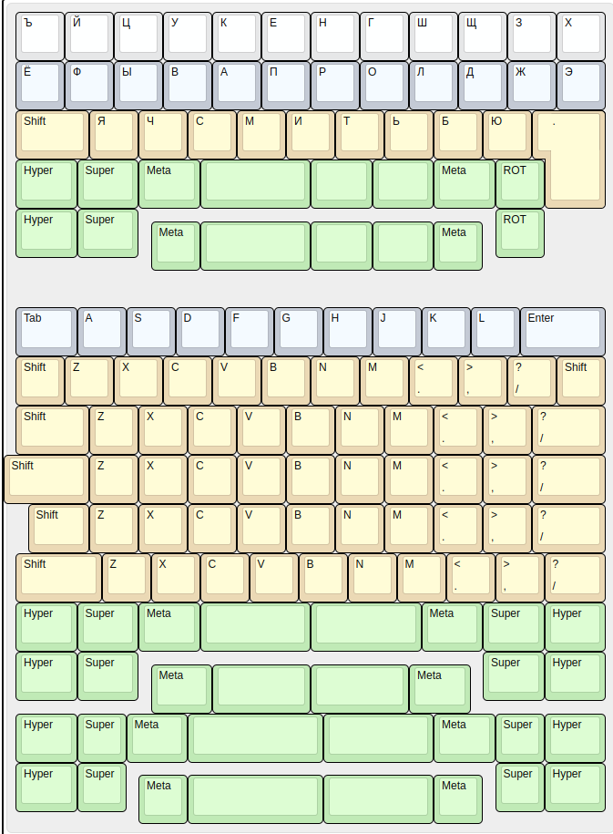
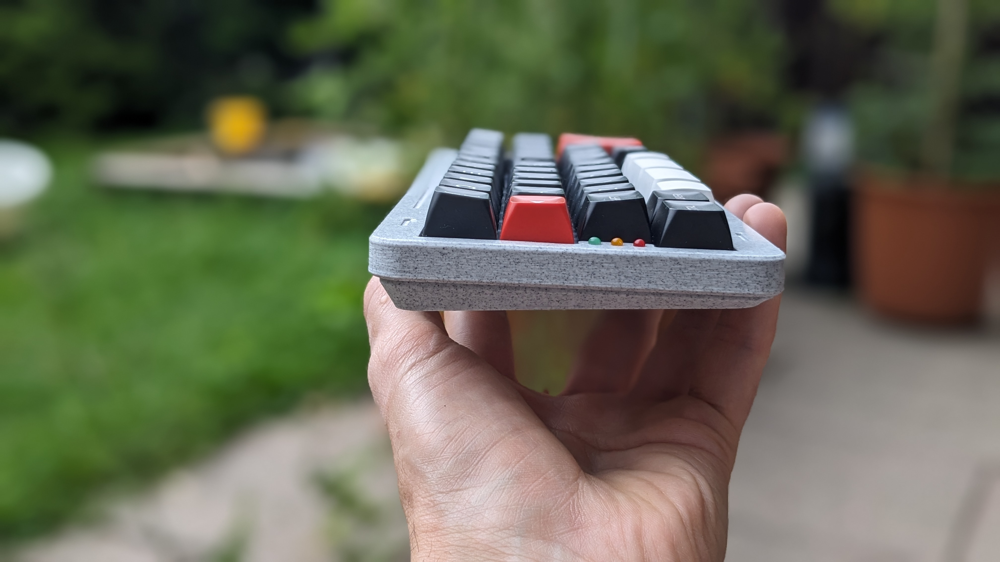

# SHIVA
A 12U 40% keyboard supporting multiple layouts, offset space bar row, and LEDs.

## About

This keyboard supports as many different layouts as possible. Currently supported are: ortho, alpha stagger, uniform 0.25U stagger, normal stagger, plus multiple space row configurations. After all, you got 5 PCBs. Note: only alpha stagger is tested.
- designed around Gateron KS27/KS33 low profile switches.
- rotary encoder support.
- bluetooth connection only. USB connection possible with an appropriate case.
- leds to display connection/battery status.
- nice!nano MCU.
- ZMK keyboard firmware support.
- open source.

## KLE

See possible configurations below:

## How to build one

I provide all the production files you will need in order to assemble the keyboard. In [prod](prod/) folder you will find the PCB gerbers and STLs for case (only one configuration is supported now). I intended the case to be CNC'd from PC, however it is not tested yet and only 3D printed it so far. There are no build instructions, as everything should be self-explanatory.

## Open source

In [source](source/) directory you will find the source files for the PCB and the case. You may use them however you like, I kindly ask you though to link back to my project, should you build it or update something.

## Gallery

